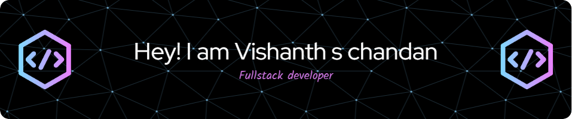

💫 **About Me**  
👋 Hi there! I'm Vishanth S. Chandan, a 3rd-year AI & Data Science engineering student at NMAMIT College.  
🌱 **I’m currently learning:** MERN stack and Data Structures & Algorithms.  
👯 **I’m looking to collaborate on:** Data science, machine learning, and Web development projects.    
⚡ **Feel Free To Ask About:** Web development, hackathons, or anything tech-related!  
🎮 **Fun Fact:** I recently tried PUBG PC and Free fire.

🚀 **Latest Projects:**  
- **BIPro:** A business intelligence platform featuring data visualizations, cleaning, knowledge graphs, and animations.  
- **Stock Guru:** A financial news and recommendation platform with live stock scores and tailored insights.  
- **Cricket Scorer App:** A real-time cricket scoring platform with authentication and MongoDB integration.  

  

🌐 Socials:

###

  
  
  
  
  
  

###

---
✨ **Always exploring, learning, and building!**  

# 💻 Tech Stack:
                               

<picture>
  <source media="(prefers-color-scheme: dark)" srcset="https://raw.githubusercontent.com/tobiasmeyhoefer/tobiasmeyhoefer/output/github-snake-dark.svg" />
  <source media="(prefers-color-scheme: light)" srcset="https://raw.githubusercontent.com/tobiasmeyhoefer/tobiasmeyhoefer/output/github-snake.svg" />
  
</picture>
